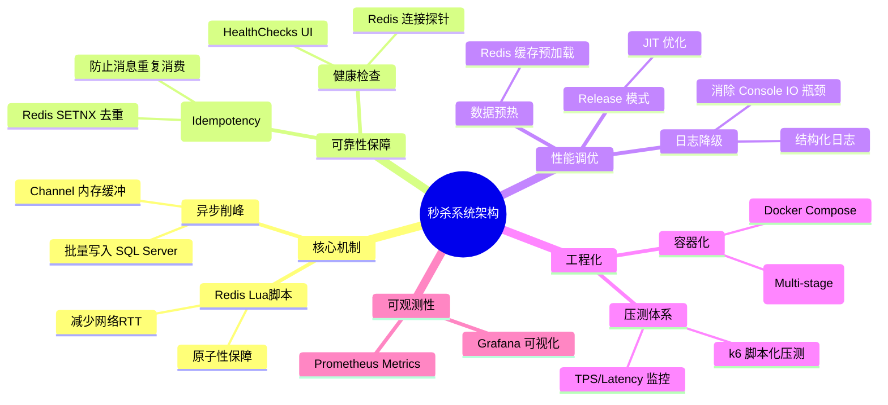

# 系统架构文档 (System Architecture)

本文档描述了 `ConcurrencyDemo` 高性能秒杀微服务的架构设计。

## 架构概览

本系统采用 **CQRS (命令查询职责分离)** 的变体思想，将“库存扣减”（高频写）与“数据持久化”（低频写）分离，利用 Redis 的原子性和 System.Threading.Channels 的异步缓冲能力，实现了高吞吐、低延迟的秒杀业务。

```mermaid
graph TD
    %% 外部流量
    User([k6 / User]) -->|POST /api/deduct| API[ASP.NET Core Web API]

    %% 核心业务流程
    subgraph "Application (ConcurrencyDemo)"
        direction TB
        
        %% 同步路径
        API -->|1. Atomic Deduct| LuaService[RedisLuaStock]
        LuaService -->|EVAL Lua Script| Redis[(Redis Primary)]
        
        %% 异步路径
        API -->|2. Enqueue (if success)| Channel[[Channel<Memory>]]
        
        subgraph "Async Worker (StockSyncService)"
            Channel -->|Consume Batch| Processor[Batch Processor]
            Processor -->|3. Idempotency Check (SETNX)| Redis
        Processor -->|4. Batch Write (Transaction)| DB[(SQL Server)]
        end
        
        %% 监控埋点
        Processor -.->|Inc Counter| Metrics[Prometheus Metrics]
    end

    %% 基础设施与监控
    subgraph "Infrastructure"
        Redis
        DB
    end

    subgraph "Observability"
        Prometheus[Prometheus Server] -->|Pull /metrics| Metrics
        Grafana[Grafana] -->|Query| Prometheus
    end

    %% 样式定义
    style User fill:#f9f,stroke:#333,stroke-width:2px,color:black
    style Redis fill:#ff9,stroke:#f66,stroke-width:2px,color:black
    style DB fill:#9cf,stroke:#33f,stroke-width:2px,color:black
    style Channel fill:#dfd,stroke:#333,stroke-width:2px,color:black
    style API fill:#eee,stroke:#333,color:black
    style LuaService fill:#eee,stroke:#333,color:black
    style Processor fill:#eee,stroke:#333,color:black
```

## 核心组件说明

### 1. RedisLuaStock (原子扣减层)
*   **职责**: 处理高并发的库存扣减请求。
*   **实现**: 使用 Lua 脚本 (`EVAL`) 在 Redis 端原子执行 "Get -> Check -> Decr"。
*   **优势**: 避免了应用层锁（Distributed Lock），消除了网络往返竞争，性能极高。

### 2. StockSyncService (异步同步层)
*   **职责**: 将 Redis 的扣减结果可靠地持久化到数据库，并保证最终一致性。
*   **实现**:
    *   **Channel**: 使用无界内存队列削峰填谷。
    *   **Batching**: 消费者一次读取多条请求，合并为单次数据库事务提交。
    *   **Idempotency**: 使用 Redis `SETNX` 对 TransactionID 进行去重，防止消息重复消费。

### 3. 可观测性 (Observability)
*   **Metrics**: 暴露 `/metrics` 端点，提供 `stock_consumed_total` 等业务指标。
*   **Logging**: 集成 Serilog，提供结构化日志（Warning 级别以上输出到控制台）。
*   **HealthChecks**: 提供 `/health` 端点，实时监控 Redis 连接状态。

## 数据流向
1.  **Request**: 用户发起扣减请求。
2.  **Redis**: Lua 脚本瞬间完成内存扣减，返回成功/失败。
3.  **Response**: API 立即返回给用户（低延迟）。
4.  **Async**: 扣减成功的消息被丢入 Channel。
5.  **Persist**: 后台线程批量获取消息 -> Redis 去重 -> 合并 SQL -> 写入 SQL Server。

## 知识点思维导图


